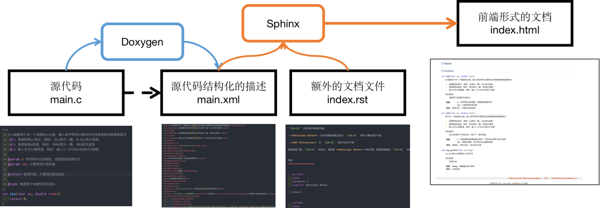

# X2W-OS 文档维护手册

本文档是 `X2W-OS`的文档维护手册，用于指导开发者如何为 `X2W-OS`编写、维护文档

## 为什么需要文档系统

如果项目的规模较小，那么文档系统可能对自己没有太大帮助。但是随着项目越来越大，当我们写了上万行代码、几十几百个函数和结构体，然后在某一日我们因为debug需要看几个周前的代码的时候，我们往往会一脸懵逼。

因此在开发的时候我们最好为代码编写文档，写文档一方面可以帮助自己总结和记录工作，另一方面可以帮助其他人快速了解你的软件、知道你的软件如何使用。

但是随着项目越来越大，文档也越来越复杂。人们迫切需要一种软件以帮助开发者维护文档。这就催生了文档系统，例如 `Javadoc`。通过在源代码中特殊的注释方式，就可以通过 `Javadoc`程序为 `Java`项目生成非常标准的文档。并且文档系统会分析类之间的继承关系，区分类型，形成查询索引，大大减轻了人工创建和维护文档的负担。更方便地是，它可以直接生成在线的网页使得文档的查阅变得很方便。

## 原理

`C/C++`项目的文档系统是 `Doxygen`。而 `Python`项目的文档系统则是 `Sphinx`。

`Doxygen`虽然也可以生成网页形式的文档，但是其生成的文档很丑，而且功能很差。通过 `Doxygen`生成的文档看起来像90年代的工程，并且难以支持全文搜索和索引等功能。而 `Sphinx`不仅具有优美的文档主题（`Sphinx`具有 `Theme Gallary`），而且具有非常多的功能。一些著名的项目，例如 `Pytorch`，就是利用 `Sphnix`管理其文档的。

因此，`X2W-OS`的文档系统原理如下：

- 使用 `Doxygen`作为 `Backend`解析源代码，生成格式化的描述信息（而非直接输出前端形式的文档）
- 使用 `Sphinx`作为 `ForntEnd`解析格式化的描述信息，并生成前端形式的文档

最后使用第三方应用，例如 `node.js`、`Python`，启动 `HTTP Server`以在本地阅读文档；此外，由于 `Sphinx`支持在 `ReadTheDocs`上托管文档，因此也能够在线阅读文档。

## reStructuredText介绍

`Sphinx`默认的语言是 `reStructuredText` (`.rst`文件)。`reStructuredText`和 `Markdown`一样，也是一种标记语言，但是 `reStructuredText`在 `Markdown`的基础上进行了扩展，实现了能够生成内容更加复杂的文档。

`reStructuredText`可以视为 `Markdown`的超集，具体来说：

- `reStructuredText`支持 `Markdown`中的所有标记（以另外的语法实现)
- `reStructuredText`具有形如 `:功能:`这样的特殊标记，例如： `:ref:`、`:caption:`等等
- `reStructuredText`支持形如 `.. 指令::`这样标记形式的指令，例如： `.. toctree::`指令将生成目录，`.. doxygenclass:: `将生成类的描述信息……

`reStructuredText`支持第三方库进行扩展。不同于 `Markdown `将 `[toc]`等功能纳入语法标准，`reSturecturedText`语法标准只有诸如强调、斜体等标记，而将生成目录等功能视为额外的功能，由第三方库实现，而后在 `.rst`源文件中以指令的形式调用。

## reSturcturedText语法介绍

`reStructuredText`的语法分为两部分：

- 标准语法：`reStructuredText`标准要求的语法，主要是标记
- 第三方语法：第三方库实现的语法，主要是指令

对标准语法的学习，可以参考如下教程：

- https://www.megengine.org.cn/doc/stable/zh/development/docs/restructuredtext.html#
- https://docutils.sourceforge.io/rst.html

而第三方语法（指令）的学习，主要参考所安装的第三方库的说明文档。例如本项目中使用到的第三方库：

- `breathe`：将 `Doxygen`生成的 `xml`格式的文档描述信息进行解析，而后提供生成 `C`语言函数、结构体的文档的 `reStructuredText`指令
- `myst-parser`：将 `Markdown`文件解释为 `reStructuredText`文件，而后生成文档，即实现文档中混合使用 `reStructuredText`和 `Markdown`

## Sphinx文档系统学习

学习完 `reStructuredText`，你只能写出单个的 `rst`文件，还没有办法写出完整的 `Sphinx`文档。为了能够参与编写文档，你还需要学习 `Sphinx`是如何组织 `reStructuredText`文件以形成一个文档的。

为此，最好的办法就是看一些使用 `Sphinx`作为文档系统的项目的文档系统部分的源码。下面是一个我推荐的学习资料：

- https://github.com/leimao/Sphinx-CPP-TriangleLib

你也可以自己寻找资源学习 `Sphinx`文档系统

> 注意，网上不少教程讲解的内容包括：
>
> - 如何为当前项目创建一个 `Sphinx`文档系统
> - 如何为 `Sphinx`文档系统编写文档
> - …
>
> 我已经为 `X2W-OS`创建了文档系统，因此请不要重复运行创建 `Sphinx`文档系统的命令以防止当前的文档系统被覆盖

## Doxygen语法学习

关于函数 `API`部分的文档是通过 `Doxygen`解析的，因此需要在源代码中进行标记，为此你需要学习 `Doxygen`的语法。

关于 `Doxygen`的语法，网上已经有不少很好的教程了，这里我就不赘述了。
